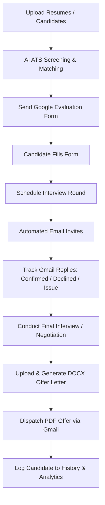

# Nikitha Build Tech - HR AI Recruitment Portal

Welcome to the **Nikitha Build Tech HR AI Recruitment Portal**, a state-of-the-art, end-to-end applicant tracking, assessment, and onboarding automation platform designed specifically for the HR team at Nikitha Build Tech Pvt. Ltd.

This system streamlines the candidate recruitment lifecycle—from resume parsing and ATS scoring to Google Form evaluations, interview coordination, automated attendance tracking via Gmail replies, analytics reporting, and dynamic offer letter generation.

---

## 🏗️ Project Architecture Overview

The system is structured as a decoupled web application containing:
1. **Frontend (React v19 + Vite)**: A highly interactive, premium metallic-themed single-page application powered by `framer-motion` for fluid micro-interactions, custom animations, and layout transitions.
2. **Backend (Python + FastAPI)**: A high-performance, asynchronous REST API utilizing Pandas for data processing, python-docx for Word document generation, and direct SMTP/IMAP integrations for two-way communication.
3. **Database (MySQL)**: Persistent storage for candidates, interview tracking, historical data, rejected candidates, settings, and analytical metrics.

### System Workflow


---

## 🚀 Key Features & Enhancements

### 1. Multi-User Workspace & Tenant Scoping
- **Frontend localStorage Isolation**: Globally intercepts all browser `localStorage` read/write operations (implemented in [index.jsx](file:///c:/Mypc/Projects/Hr_Final/Nikitha_Hr_portal/Source_code/frontend/src/index.jsx)) to inject a unique `${user_email}_` prefix for each key (excluding core authentication keys: `token`, `username`, and `gmail`). This guarantees that candidate queues, active jobs, page-specific progress states, and countdown timers remain fully isolated per user session.
- **Header Scoping Interceptor**: Modifies Axios request intercepts in [api.js](file:///c:/Mypc/Projects/Hr_Final/Nikitha_Hr_portal/Source_code/frontend/src/services/api.js) to attach a custom `X-User-Email` header with the logged-in user's email.
- **Backend File Isolation**: Scopes SMTP/IMAP credentials, email subject/body templates, Google Forms sheet links, and `.docx` templates based on the incoming `X-User-Email` header. Saved files are stored as `email_settings_{email}.json`, `email_template_{email}.json`, `google_form_{email}.json`, `google_template_{email}.json`, `{email}_offer.docx`, and `{email}_intern_offer.docx`.
- **Automatic Fallback Design**: If the headers are not present or files do not exist, the backend seamlessly falls back to legacy shared `.env` variables and global template configurations.

### 2. AI & Local Fallback ATS Resume Screening
- **Gemini AI Integration**: Uses Google Gemini API for deep semantic parsing of skills, qualifications, work experience, and locations.
- **Local Keyword-Matching Fallback**: If the Gemini API is unavailable or quota is exceeded, the system automatically triggers a local regex-based keyword matching fallback (`_local_fallback_analysis` in [ai_resume.py](file:///c:/Mypc/Projects/Hr_Final/Nikitha_Hr_portal/Source_code/backend/app/services/ai_resume.py)) to ensure ATS scoring and parsing never crash.
- **Quota Warnings**: Front-end detects quota exceptions and notifies the HR user via detailed warning toasts.

### 3. High-Fidelity UI/UX & Animations
- **Modern Vite Migration**: Fully migrated from `react-scripts` to Vite for blazing-fast development hot reloading and optimized production bundles.
- **Premium Skeuomorphic Metallic Styling**: Styled with expanding circle hovers, active click compression animations, and clean rounded tab pills.
- **Layout Enhancements**: Centered "Analyze Candidates" button, floating micro-animations on file drop-zones, and side-by-side badge alignments for Job Descriptions and Resumes.
- **Restricted Calendar Inputs**: Integrated safety guards in date/time selectors (`type="datetime-local"`) for scheduling and forms to restrict inputs to future dates only.

### 4. Google Form Evaluations & State Controls
- **Google Sheets Sync**: Fetches candidate form entries directly from Google Sheets CSV links.
- **Dynamic Timer Controls**: Countdown timer sets deadlines for candidates. When the timer is active, the **"Send Google Form"** option is automatically hidden to prevent duplicate dispatches.

### 5. Clean Candidate Assessment Forms
- **Printable Assessment Report**: Modernized the Candidate History modal to show a clean **3-page Paper Layout** (Interview Assessment Form, Face-to-Face Interview HR, Final Interview & Benefits) suitable for printing or saving to PDF.
- **Immediate Form Access**: The printable report modal starts directly on **"Interview Assessment Form"**, removing the digital-only progress graph and overview tables.

### 6. Secure Authentication
- **Branded Login Page**: Features an enlarged circular company logo absolute-positioned in the top-left corner of the illustration container.
- **Clean Interface**: Removed the "Remember me" checkbox and "Forgot password?" links, as well as the company name text header.
- **Restricted Access**: Disabled the "Create account" signup link on the login page to secure portal access.

---

## 🛠️ Tech Stack & Key Libraries

### Frontend
- **React v19.2** & **React Router v7**
- **Vite v6**: High-speed development server and bundler.
- **Framer Motion v12.3**: Smooth UI micro-interactions.
- **React Hot Toast**: Styled slate-900 background pop-up alerts.
- **html2pdf.js**: Client-side high-quality PDF rendering.

### Backend
- **FastAPI**: Asynchronous Python web framework.
- **Pandas**: Google Sheets data parsing and cleaning.
- **python-docx** & **pdfplumber**: DOCX generation and PDF text parsing.
- **mysql-connector-python**: Official MySQL driver.
- **IMAP / SMTP**: Automatic email invitation and response parsers.

---

## 📁 Repository Structure

```text
Nikitha_Hr_portal/
├── Source_code/
│   ├── backend/
│   │   ├── app/
│   │   │   ├── database/       # DB Connection and Init SQL scripts
│   │   │   ├── models/         # Pydantic schemas and database models
│   │   │   ├── routes/         # API endpoints (candidates, history, reports, settings)
│   │   │   ├── services/       # Google sheet parsers, schedulers, and AI processors
│   │   │   ├── utils/          # Resume text extractors, parsers, and text matchers
│   │   │   └── main.py         # App entrypoint, CORS configuration, router listings
│   │   ├── uploads/            # Temporary directory for uploaded resumes/templates
│   │   ├── requirements.txt    # Python dependencies
│   │   └── .env                # Secure environmental variables (Git ignored)
│   │
│   ├── frontend/
│   │   ├── src/
│   │   │   ├── components/
│   │   │   │   ├── pages/      # Route pages (Upload, Candidates, Reports, Final)
│   │   │   │   ├── Header.jsx  # Global layout header
│   │   │   │   ├── Sidebar.jsx # Side navigation
│   │   │   │   └── Layout.jsx  # Layout structure
│   │   │   ├── services/       # API axios clients
│   │   │   ├── App.jsx         # App routers and global toast wrappers
│   │   │   ├── index.jsx       # DOM render target
│   │   │   └── styles.css      # Core skeuomorphic metallic styling system
│   │   └── package.json        # Frontend node packages
└── README.md                   # Full-project documentation (This file)
```

---

## 💾 Database Schema

The system initializes a MySQL schema on startup (`app.database.db.init_db`). It contains three primary tables:

### 1. `candidate_history`
Maintains entries for all hired and onboarded candidates.
- `id` (INT, Primary Key, Auto-Increment)
- `name` (VARCHAR)
- `email` (VARCHAR, Unique)
- `job_role` (VARCHAR)
- `job_type` (VARCHAR)
- `salary` (VARCHAR)
- `joining_date` (VARCHAR)
- `form_data` (TEXT/JSON)
- `created_at` (TIMESTAMP)

### 2. `rejected_history`
Maintains records of candidates rejected at specific stages in the pipeline.
- `id` (INT, Primary Key, Auto-Increment)
- `name` (VARCHAR)
- `email` (VARCHAR)
- `job_role` (VARCHAR)
- `rejected_round` (VARCHAR)
- `form_data` (TEXT/JSON)
- `created_at` (TIMESTAMP)

### 3. `recruitment_funnel_stats`
Aggregates stage logs, counts, and funnel drop-off reports.
- `id` (INT, Primary Key, Auto-Increment)
- `job_id` (VARCHAR)
- `job_role` (VARCHAR)
- `total_uploaded` (INT)
- `google_form_sent` (INT)
- `google_form_filled` (INT)
- `created_at` (TIMESTAMP)

---

## 🚀 Installation & Local Setup

### Prerequisites
- **Node.js** (v18.0.0 or higher)
- **Python** (3.9 to 3.12)
- **MySQL Server** (v8.0 or higher)

### 1. Database Configuration
1. Start your local MySQL server.
2. The database configuration settings can be adjusted in `backend/.env`:
   - **DB_HOST**: `localhost`
   - **DB_USER**: `root`
   - **DB_PASSWORD**: `your_mysql_password`
   - **DB_NAME**: `hr_ai_db`

### 2. Backend Setup
1. Navigate to the backend directory:
   ```bash
   cd Source_code/backend
   ```
2. Install Python dependencies:
   ```bash
   pip install -r app/requirements.txt
   ```
3. Create a `.env` file in the backend root directory and configure your credentials:
   ```env
   GEMINI_API_KEY=your_gemini_api_key_here
   DB_HOST=localhost
   DB_USER=root
   DB_PASSWORD=your_database_password_here
   DB_NAME=hr_ai_db
   SENDER_EMAIL=your_hr_email@gmail.com
   EMAIL_PASSWORD=your_16_character_app_password
   ```
4. Start the backend development server using Uvicorn:
   ```bash
   python -m uvicorn app.main:app --reload
   ```
   *The API will run locally at `http://127.0.0.1:8000`.*

### 3. Frontend Setup
1. Navigate to the frontend directory:
   ```bash
   cd Source_code/frontend
   ```
2. Install node dependencies:
   ```bash
   npm install
   ```
3. Start the Vite React development server:
   ```bash
   npm run dev
   ```
   *The client interface will open at `http://localhost:3000`.*

---

## 📡 API Routing Reference

Here is a breakdown of the backend API routes available in the system:

### 📂 Resume Upload & Parsing
- `POST /upload`: Parses uploaded `.pdf` or `.docx` resume files, runs ATS scoring against the current JD, and returns parsed candidate details.
- `POST /analyze`: Invokes AI-scoring helper models to extract experience level, skill matches, location, and graduation criteria.

### 👤 Candidates & Pipeline Routing
- `GET /candidates`: Fetches all candidates current in the system.
- `POST /candidates/bulk`: Bulk inserts parsed candidate models into the database.
- `POST /update`: Updates candidate details (e.g. status, score, notes) during pipeline reviews.
- `GET /final`: Fetches the list of candidates who have advanced to final interview stages.
- `DELETE /candidates/reset`: Clears candidates from active pipeline tracker.

### 📅 Interview Scheduling
- `POST /schedule`: Schedules an interview for a candidate (specifying date, time, and link) and triggers the automated email invite via SMTP.

### 📨 Google Forms & Templates
- `POST /save-google-form`: Stores Google Sheet CSV link in config configurations.
- `GET /get-google-form`: Retrieves current Google Sheets configuration.
- `POST /save-google-template`: Saves the subject and body template for Google Form emails.
- `GET /get-google-template`: Fetches email subject/body for Google Form invitations.
- `GET /google-form-candidates`: Pulls responses directly from the configured Google Forms sheet and maps them to active candidates.
- `POST /send-google-form`: Dispatches evaluation Google Forms via email.

### ✉️ Email Responses & Attendance
- `GET /email-replies`: Scans Gmail inbox via IMAP, fetches parsed replies, strips email history block, and caches messages.
- `POST /email-replies/send`: Sends a reply directly to a candidate from the dashboard.
- `POST /email-replies/refresh`: Busts local cache and runs a fresh IMAP scan of Gmail.
- `GET /attendance`: Returns automated attendance status classification (Confirmed, Declined, Issue).

### 🏆 Offer Letters & Rejection Dispatches
- `POST /offer-letter`: Loads `.docx` template, performs run-merges to replace dynamic variables `{name}`, `{role}`, `{salary}`, `{joining_date}`, writes a PDF format output, and dispatches it via SMTP.
- `POST /send-rejection`: Sends a rejection email and moves candidate data into `rejected_history` table.

### 📈 Reports & Analytics
- `GET /reports`: Pulls reports stats and generates funnel progress metrics.

### ⚙️ System Settings & Health Checks
- `POST /save-email-settings` / `GET /get-email-settings`: Handles Gmail app email passwords and configuration saved securely in `.env`.
- `GET /api/key-health`: Evaluates the validity, state, and warnings associated with the active Gemini API Key.
- `POST /save-template` / `GET /get-template`: System email template setups.
- `POST /test-email`: Sends a mock test email to ensure SMTP credentials are correct.

---

## ⚙️ Configuration & Operational Settings

Once the application is up and running:
1. Navigate to the **Settings** page in the sidebar.
2. Set up **Email Settings**:
   - Enter your Gmail address (e.g., `hr@nikithabuildtech.com`).
   - Enter your **Google App Password** (exactly 16 characters).
   - *This will save settings per logged-in user in `email_settings_{email}.json` and also write to the backend's `.env` file as a system default.*
3. Set up **Google Form Link**:
   - Provide the CSV export URL of your candidate application Google Form.
   - *This setting is scoped per user and saved in `google_form_{email}.json`.*
4. Upload **Offer Letter Templates**:
   - Upload Intern and Full-Time base templates (`.docx` files).
   - *Templates are saved per user as `{email}_offer.docx` and `{email}_intern_offer.docx` in the backend upload path.*
   - Ensure templates contain markers like `{name}`, `{role}`, `{salary}`, `{joining_date}`.

---

## 📧 Standard Email Templates

The portal uses standardized email communications for recruitment stages. Below is the reference email template for retracting an offer (De-offered Candidates).

### Offer Retraction (De-offered Candidate)
*To be sent if an offer needs to be cancelled or retracted due to business requirement changes.*

**Subject:** Update regarding your offer of employment — Nikitha Build Tech

Dear `{name}`,

We regret to inform you that due to unforeseen business circumstances and structural changes within our project pipelines, we must retract the offer of employment previously extended to you for the `{role}` position.

We sincerely apologize for any inconvenience this decision may cause. We appreciate the time you spent interviewing with Nikitha Build Tech and wish you success in your future professional endeavors.

Regards,  
HR Department  
Nikitha Build Tech Pvt. Ltd.

---

## 👥 Contributors & Support

Developed for **Nikitha Build Tech Pvt. Ltd.** to streamline internal hiring processes and drive automated recruitment pipelines.

For technical assistance or feature requests, contact the IT Systems team or raise a ticket.
