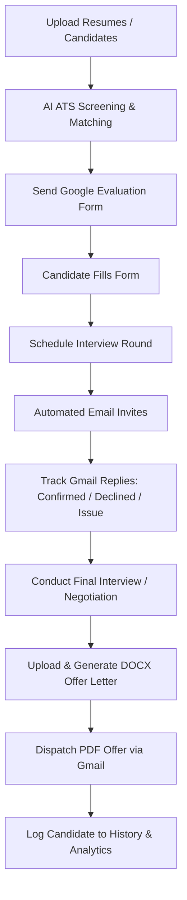

# Nikitha Build Tech - HR AI Recruitment Portal

Welcome to the **Nikitha Build Tech HR AI Recruitment Portal**, a state-of-the-art, end-to-end applicant tracking, assessment, and onboarding automation platform designed specifically for the HR team at Nikitha Build Tech Pvt. Ltd.

This system streamlines the candidate recruitment lifecycle—from resume parsing and ATS scoring to Google Form evaluations, interview coordination, automated attendance tracking via Gmail replies, analytics reporting, and dynamic offer letter generation.

---

## 🏗️ Project Architecture Overview

The system is structured as a decoupled web application containing:
1. **Frontend (React v19 + Router v7)**: A highly interactive, skeuomorphic, and premium metallic-themed single-page application powered by `framer-motion` for fluid micro-interactions and transitions.
2. **Backend (Python + FastAPI)**: A high-performance, asynchronous REST API utilizing Pandas for data processing, python-docx for Word document generation, and direct SMTP/IMAP integrations for two-way communication.
3. **Database (MySQL)**: Persistent storage for candidates, interview tracking, historical data, rejected candidates, settings, and analytical metrics.

### System Workflow


---

## 🛠️ Tech Stack & Key Libraries

### Frontend
- **React v19.2**: Core UI library.
- **React Router v7**: Layout encapsulation and client-side routing.
- **Framer Motion v12.3**: Used for dashboard animations, page transitions, and card slides.
- **React Hot Toast**: Real-time pop-up notifications for actions and errors.
- **html2pdf.js**: Client-side high-quality PDF rendering for reports and invoices.
- **Vanilla CSS3**: Engineered with a custom, premium metallic skeuomorphic styling theme.

### Backend
- **FastAPI**: Asynchronous web framework for high-throughput routing.
- **Pandas**: Data parsing and cleanup of Google Sheets CSV exports.
- **python-docx**: Programmatic injection of text and formatting into Word (.docx) letter templates.
- **mysql-connector-python**: Official driver to connect and query the MySQL database.
- **pdfplumber**: Extract text content from candidate PDF resumes for AI processing.
- **IMAP / SMTP**: Core Python libraries for reading email replies and dispatching automated emails.

---

## 📁 Repository Structure

```text
Nikitha_Hr_portal/
├── Source_code/
│   ├── backend/
│   │   ├── app/
│   │   │   ├── database/       # DB Connection and Init SQL scripts
│   │   │   ├── models/         # Pydantic schemas and database models
│   │   │   ├── routes/         # API endpoints (candidates, history, reports, etc.)
│   │   │   ├── services/       # Google sheet parsers, schedulers, and AI processors
│   │   │   ├── utils/          # Resume text extractors, parsers, and text matchers
│   │   │   └── main.py         # App entrypoint, CORS configuration, router listings
│   │   ├── uploads/            # Temporary directory for uploaded resumes/templates
│   │   ├── requirements.txt    # Python dependencies
│   │   └── .env                # App secrets & Gemini API key (Git ignored)
│   │
│   ├── frontend/
│   │   ├── src/
│   │   │   ├── components/
│   │   │   │   ├── pages/      # Route pages (Upload, Candidates, Reports, Final)
│   │   │   │   ├── Header.jsx  # Global layout header
│   │   │   │   ├── Sidebar.jsx # Side navigation
│   │   │   │   └── Layout.jsx  # Layout structure
│   │   │   ├── services/       # API axios clients
│   │   │   ├── App.js          # App routers and global toast wrappers
│   │   │   ├── index.js        # DOM render target
│   │   │   └── styles.css      # Core skeuomorphic metallic styling system
│   │   └── package.json        # Frontend node packages
│   │
│   ├── docs/                   # System documentations
│   │   └── diagrams/           # System workflow diagrams
│   └── docker-compose.yml      # Orchestration compose file
└── README.md                   # Full-project documentation (This file)
```

---

## 💾 Database Schema

The system initializes a MySQL schema on startup (`app.database.db.init_db`). It contains three primary tables:

### 1. `candidate_history`
Maintains entries for all hired and onboarded candidates.
- `id` (INT, Primary Key, Auto-Increment)
- `name` (VARCHAR)
- `email` (VARCHAR, Unique)
- `job_role` (VARCHAR)
- `job_type` (VARCHAR)
- `salary` (VARCHAR)
- `joining_date` (VARCHAR)
- `form_data` (TEXT/JSON)
- `created_at` (TIMESTAMP)

### 2. `rejected_history`
Maintains records of candidates rejected at specific stages in the pipeline.
- `id` (INT, Primary Key, Auto-Increment)
- `name` (VARCHAR)
- `email` (VARCHAR)
- `job_role` (VARCHAR)
- `rejected_round` (VARCHAR)
- `form_data` (TEXT/JSON)
- `created_at` (TIMESTAMP)

### 3. `recruitment_funnel_stats`
Aggregates stage logs, counts, and funnel drop-off reports.
- `id` (INT, Primary Key, Auto-Increment)
- `job_id` (VARCHAR)
- `job_role` (VARCHAR)
- `total_uploaded` (INT)
- `google_form_sent` (INT)
- `google_form_filled` (INT)
- `created_at` (TIMESTAMP)

---

## 🚀 Installation & Local Setup

### Prerequisites
- **Node.js** (v18.0.0 or higher)
- **Python** (3.9 to 3.12)
- **MySQL Server** (v8.0 or higher)

### 1. Database Configuration
1. Start your local MySQL server.
2. The database configuration settings can be adjusted in `backend/app/database/db.py`:
   - **Host**: `localhost`
   - **User**: `root`
   - **Password**: `admin`
   - **Database**: `nikitha_hr_db`

### 2. Backend Setup
1. Navigate to the backend directory:
   ```bash
   cd Source_code/backend
   ```
2. Install Python dependencies:
   ```bash
   pip install -r app/requirements.txt
   ```
3. Create a `.env` file in the backend root directory and configure your credentials:
   ```env
   # Gemini API Key for parsing resume texts
   GEMINI_API_KEY=your_gemini_api_key_here
   ```
4. Start the backend development server using Uvicorn:
   ```bash
   python -m uvicorn app.main:app --reload
   ```
   *The API will run locally at `http://127.0.0.1:8000`.*

### 3. Frontend Setup
1. Navigate to the frontend directory:
   ```bash
   cd Source_code/frontend
   ```
2. Install node dependencies:
   ```bash
   npm install
   ```
3. Start the React development server:
   ```bash
   npm start
   ```
   *The client interface will open at `http://localhost:3000`.*

---

## 📡 API Routing Reference

Here is a breakdown of the backend API routes available in the system:

### 📂 Resume Upload & Parsing
- `POST /upload`
  - **Function**: `upload_resumes`
  - **Description**: Parses uploaded `.pdf` or `.docx` resume files, extracts keywords, runs ATS scoring against the current JD, and returns parsed candidate details.

- `POST /analyze`
  - **Function**: `analyze_resumes`
  - **Description**: Invokes AI-scoring helper models to extract experience level, skill matches, location, and graduation criteria.

### 👤 Candidates & Pipeline Routing
- `GET /candidates`
  - **Function**: `get_candidates`
  - **Description**: Fetches all candidates current in the system.
- `POST /candidates/bulk`
  - **Function**: `add_candidates_bulk`
  - **Description**: Bulk inserts parsed candidate models into the database.
- `POST /update`
  - **Function**: `update_candidate`
  - **Description**: Updates candidate details (e.g. status, score, notes) during pipeline reviews.
- `GET /final`
  - **Function**: `get_final`
  - **Description**: Fetches the list of candidates who have advanced to final interview stages.
- `DELETE /candidates/reset`
  - **Function**: `reset_candidates`
  - **Description**: Clears candidates from active pipeline tracker.

### 📅 Interview Scheduling
- `POST /schedule`
  - **Function**: `schedule`
  - **Description**: Schedules an interview for a candidate (specifying date, time, and link) and triggers the automated email invite via SMTP.

### 📨 Google Forms & Templates
- `POST /save-google-form`
  - **Function**: `save_google_form`
  - **Description**: Stores Google Sheet CSV link in config configurations.
- `GET /get-google-form`
  - **Function**: `get_google_form`
  - **Description**: Retrieves current Google Sheets configuration.
- `POST /save-google-template`
  - **Function**: `save_google_template`
  - **Description**: Saves the subject and body template for Google Form emails.
- `GET /get-google-template`
  - **Function**: `get_google_template`
  - **Description**: Fetches email subject/body for Google Form invitations.
- `GET /google-form-candidates`
  - **Function**: `google_form_candidates`
  - **Description**: Pulls responses directly from the configured Google Forms sheet and maps them to active candidates.
- `POST /send-google-form`
  - **Function**: `send_google_form`
  - **Description**: Dispatches evaluation Google Forms via email.
- `POST /reset-batch`
  - **Function**: `reset_batch`
  - **Description**: Resets candidate sync status parameters.

### ✉️ Email Responses & Attendance
- `GET /email-replies`
  - **Function**: `get_email_replies`
  - **Description**: Scans Gmail inbox via IMAP, fetches parsed replies, strips email history block, and caches messages.
- `POST /email-replies/send`
  - **Function**: `send_reply`
  - **Description**: Sends a reply directly to a candidate from the dashboard.
- `POST /email-replies/refresh`
  - **Function**: `refresh_replies`
  - **Description**: Busts local cache and runs a fresh IMAP scan of Gmail.
- `GET /attendance`
  - **Function**: `get_attendance`
  - **Description**: Returns automated attendance status classification (Confirmed, Declined, Issue).
- `POST /attendance/override`
  - **Function**: `override_attendance`
  - **Description**: Allows manual override of interview attendance status.
- `DELETE /attendance/reset`
  - **Function**: `reset_attendance`
  - **Description**: Resets local attendance caches.

### 🏆 Offer Letters & Rejection Dispatches
- `POST /offer-letter`
  - **Function**: `send_offer_letter`
  - **Description**: Loads `.docx` template, performs run-merges to replace dynamic variables `{name}`, `{role}`, `{salary}`, `{joining_date}`, writes a PDF format output, and dispatches it via SMTP.
- `POST /send-rejection`
  - **Function**: `send_rejection`
  - **Description**: Sends a rejection email and moves candidate data into `rejected_history` table.

### 📈 Reports & Analytics
- `POST /reports/funnel-stats`
  - **Function**: `update_funnel_stats`
  - **Description**: Inserts snapshot stats for recruitment stages.
- `GET /reports`
  - **Function**: `get_reports`
  - **Description**: Pulls reports stats and generates funnel progress metrics.

### ⚙️ System Settings
- `POST /save-email-settings` / `GET /get-email-settings`
  - **Functions**: `save_email_settings` / `get_email_settings`
  - **Description**: Handles Gmail app email passwords and configuration.
- `POST /save-template` / `GET /get-template`
  - **Functions**: `save_template` / `get_template`
  - **Description**: System email template setups.
- `POST /upload-offer-template` / `POST /upload-intern-offer-template`
  - **Functions**: `upload_offer_template` / `upload_intern_offer_template`
  - **Description**: Handles upload of full-time and intern `.docx` template files.
- `GET /check-offer-template`
  - **Function**: `check_offer_template`
  - **Description**: Verifies if system templates exist on disk.
- `POST /test-email`
  - **Function**: `test_email`
  - **Description**: Sends a mock test email to ensure SMTP credentials are correct.

---

## ⚙️ Configuration & Operational Settings

Once the application is up and running:
1. Navigate to the **Settings** page in the sidebar.
2. Set up **Email Settings**:
   - Enter your Gmail address (e.g., `hr@nikithabuildtech.com`).
   - Enter your **Google App Password** (not your login password).
3. Set up **Google Form Link**:
   - Provide the CSV export URL of your candidate application Google Form.
4. Upload **Offer Letter Templates**:
   - Upload Intern and Full-Time base templates (`.docx` files).
   - Ensure templates contain markers like `{name}`, `{role}`, `{salary}`, `{joining_date}`.

---

## 📧 Standard Email Templates

The portal uses standardized email communications for recruitment stages. Below is the reference email template for retracting an offer (De-offered Candidates).

### Offer Retraction (De-offered Candidate)
*To be sent if an offer needs to be cancelled or retracted due to business requirement changes.*

**Subject:** Update regarding your offer of employment — Nikitha Build Tech

Dear `{name}`,

We regret to inform you that due to unforeseen business circumstances and structural changes within our project pipelines, we must retract the offer of employment previously extended to you for the `{role}` position.

We sincerely apologize for any inconvenience this decision may cause. We appreciate the time you spent interviewing with Nikitha Build Tech and wish you success in your future professional endeavors.

Regards,  
HR Department  
Nikitha Build Tech Pvt. Ltd.

---

## 👥 Contributors & Support

Developed for **Nikitha Build Tech Pvt. Ltd.** to streamline internal hiring processes and drive automated recruitment pipelines.

For technical assistance or feature requests, contact the IT Systems team or raise a ticket.
